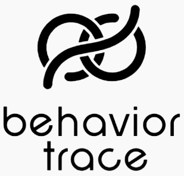
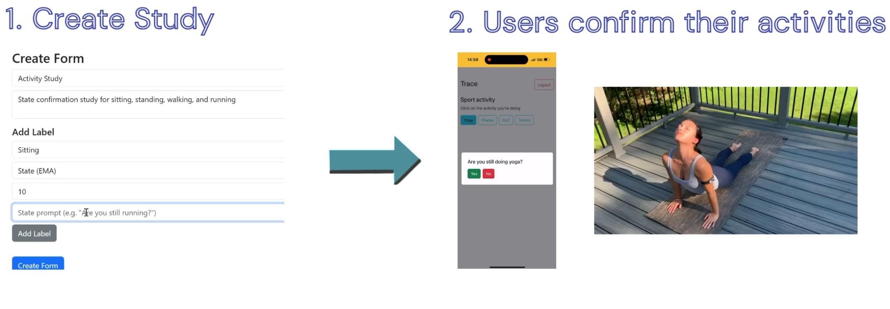
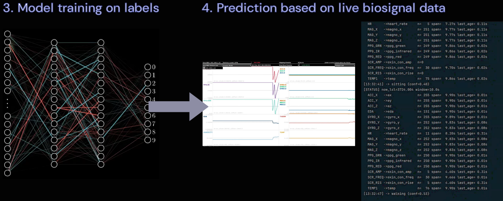

BehaviorTrace is a one-stop solution for labs and researchers who want to design, run, and analyze **wearable biosignal state-confirmation studies**.

The system is built using **EmotiBit**, an open-source wearable that monitors and records biosignals. BehaviorTrace allows study participants to label behaviors or internal states (EMA), which are later combined with biosignals to train **machine learning–based prediction models**.

> **Current version:**  
> Supports **state confirmation / EMA-based studies only**.

---

## What BehaviorTrace Enables

- Real-world ground truth collection via EMA  
- Temporal alignment of physiology and subjective experience  
- High-quality labeled datasets for ML  
- End-to-end study workflows without custom app development  

---

## Getting Started

Full setup and study documentation is available here:

➡️ https://github.com/geddie212/BehaviorTrace_docs

---

## Two-Stage Workflow

### Stage 1 — Study Setup & EMA Labeling
- Initial platform setup
- Form creation
- Participant EMA labeling via PWA

---

### Stage 2 — Data Processing, Training & Prediction
- Process EmotiBit SD card data
- Upload biosignals to SQL
- Train models and run live predictions

---

## Machine Learning Strategy

- Uses a **window / stride–based approach**
- Required due to **mixed EmotiBit sampling rates**
- Supports robust multi-modal time-series alignment

---

## Design Philosophy

BehaviorTrace is designed to:
- Be easy to deploy
- Be researcher-friendly
- Support end-to-end biosignal studies

---

## Example Study Types

### Stress & Emotional Regulation
**Biosignals:** HR, HRV, EDA, skin temperature  
**EMA prompts:** “Are you feeling stressed right now?”

### Substance Use, Craving & Withdrawal
**Biosignals:** HRV, EDA, accelerometer, temperature  
**EMA prompts:** “Are you experiencing a craving?”

### Physical Activity & HAR
**Biosignals:** Accelerometer, gyroscope, HR  
**EMA prompts:** “What activity are you doing right now?”

### Sleep & Fatigue
**Biosignals:** HRV, temperature, motion  
**EMA prompts:** “How tired do you feel right now?”

### Mental Health & Affective State
**Biosignals:** HRV, EDA  
**EMA prompts:** “Rate your mood right now”

### Pain & Symptom Monitoring
**Biosignals:** HR, HRV, EDA  
**EMA prompts:** “Rate pain intensity (1–10)”

### Cognitive Load & Attention
**Biosignals:** HRV, EDA  
**EMA prompts:** “How mentally demanding is this task?”

### Social Interaction & Context-Aware Studies
**Biosignals:** HRV, EDA  
**EMA prompts:** “Are you alone or with others?”

### JITAI & Adaptive Interventions
**Purpose:** Trigger interventions when risk states are detected

### Model Training & Ground Truth Validation
**Purpose:** Create high-quality labeled datasets for ML

---

## Repository Purpose

This repository enables study creators to:
- Create and conduct studies
- Collect biosignal + EMA data
- Train and evaluate prediction models
